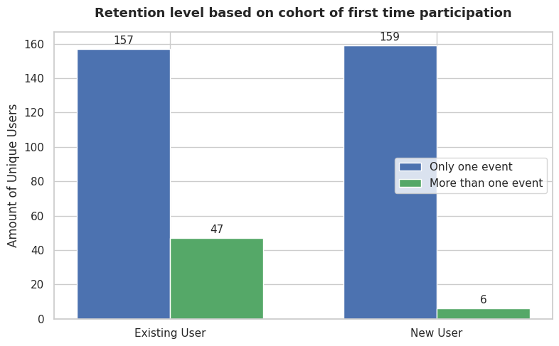
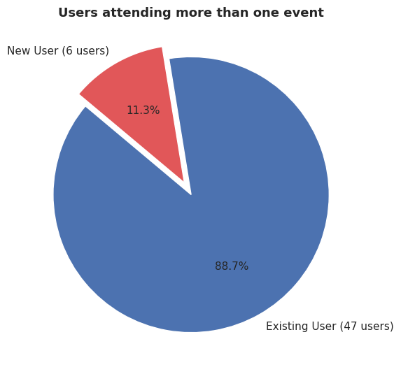

# Wikimedia Indonesia Data & Technology Program Analytics (2025–2026)

## Overview
This repository contains data analytics pipelines, data cleaning scripts, and post-event retention tracking models for the Data and Technology Team of Wikimedia Indonesia. The primary goal is to evaluate training outcomes, editor engagement, and long-term retention, with a specific focus on contributions to the [Wikidata](https://www.wikidata.org) project.

The dataset covers campaign activities from 2025 through 2026, capturing cohort performance across regional workshops, university training programs (Wikilatih), and edit-a-thons (Geodatathon / Datathon).

---

## Data Source & Attribution
All data in this repository is sourced publicly from the Wikimedia Outreach Dashboard:
* Campaign Overview: [Wikimedia Indonesia Data and Technology Campaign 2025](https://outreachdashboard.wmflabs.org/campaigns/data_dan_teknologi_wikimedia_indonesia_2025/overview)
* Target Project: [Wikidata](https://www.wikidata.org/wiki/Wikidata:Main_Page)

---

## Campaign Summary Statistics
Key metrics extracted from the Outreach Dashboard datasets:
* Total Training Events: 33 activities
* Total Student Enrollments: 446 enrollments (369 unique editors post-cleaning)
* Total Revisions: Over 370,000 edits
* Total Wikidata Items Created: Over 7,600 items

---

## Methodology & Retention Framework
1. Data Cleaning & Standardization: Resolving string/numeric data type mismatches, normalizing usernames, and mapping local wiki IDs against global CentralAuth identifiers.
2. Cohort Segmentation: Isolating New Users (account age <= 7 days at registration) from Existing Users to eliminate pre-existing activity bias when evaluating training effectiveness.
3. Participation & Retention Tracking: Measuring repeat participation levels across training sessions to calculate return rates and longitudinal contributor engagement.

---

## Key Findings & Insight Analysis

### Retention Overview
Participation analysis across 369 unique editors highlights a significant variance in return rates between new and established account holders:

| Cohort | Single Event Participant | Repeat Participant (>1 Event) | Total Unique Users | Retention Rate |
| :--- | :--- | :--- | :--- | :--- |
| **Existing User** | 157 | **47** | 204 | **23.0%** |
| **New User** | 159 | **6** | 165 | **3.6%** |
| **Total** | **316** | **53** | **369** | **14.4%** |

* Out of 165 new users, only 3.6% (6 users) returned for subsequent events, highlighting a steep drop-off immediately following initial training sessions.
* The vast majority of retained participants (88.7% or 47 users) held active accounts prior to the events, demonstrating that repeat engagement relies heavily on pre-existing contributors.

---

### Analytical Context & Limitations
* Contributing to Wikimedia projects is inherently a voluntary hobby. Encouraging individuals to regularly dedicate personal time to open data and open knowledge presents a complex retention challenge.
* Unlike Wikipedia or Wikimedia Commons where edits yield immediate visual feedback, Wikidata functions as a graph-based knowledge base. Because its data is primarily consumed programmatically through SPARQL, SQL, linked data, or Web 3.0, non-technical beginners often struggle to observe the tangible impact of their contributions right away.
* The New User cohort strictly captures account creation recency (<= 7 days from event start date). Once an editor attends a second event, they are categorized under Existing User regardless of their overall experience level. While operationally effective for data modeling, qualitative onboarding typically spans several months.

---

### Strategic Recommendations
* Shift outreach targets toward academics, data practitioners, and domain experts in fields such as GLAM, botany, or zoology. Focusing on thematic data integration aligns Wikidata's complexity with audiences who already possess relevant technical skills and domain interests.
* Recognize the trade-offs of a targeted approach. While user retention numbers may remain modest due to the niche nature of the work, project success can instead be measured by data utility, evaluating how contributed data is actively queried, visualized, and integrated into external applications or research.
* For general beginner events, bridge the immediate feedback gap by integrating simple query visualizations or practical application demos into training sessions, helping new users directly visualize the real-world utility of their contributions.

---

## License
All data and content in this repository are licensed under the [Creative Commons Attribution-ShareAlike 4.0 International (CC BY-SA 4.0)](https://creativecommons.org/licenses/by-sa/4.0/) license.

Under this license, you are free to:
* Share: Copy and redistribute the material in any medium or format.
* Adapt: Remix, transform, and build upon the material for any purpose, even commercially.

Under the following terms:
* Attribution: You must give appropriate credit to Wikimedia Indonesia and the Wikimedia Outreach Dashboard.
* ShareAlike: If you remix, transform, or build upon the material, you must distribute your contributions under the same license as the original.