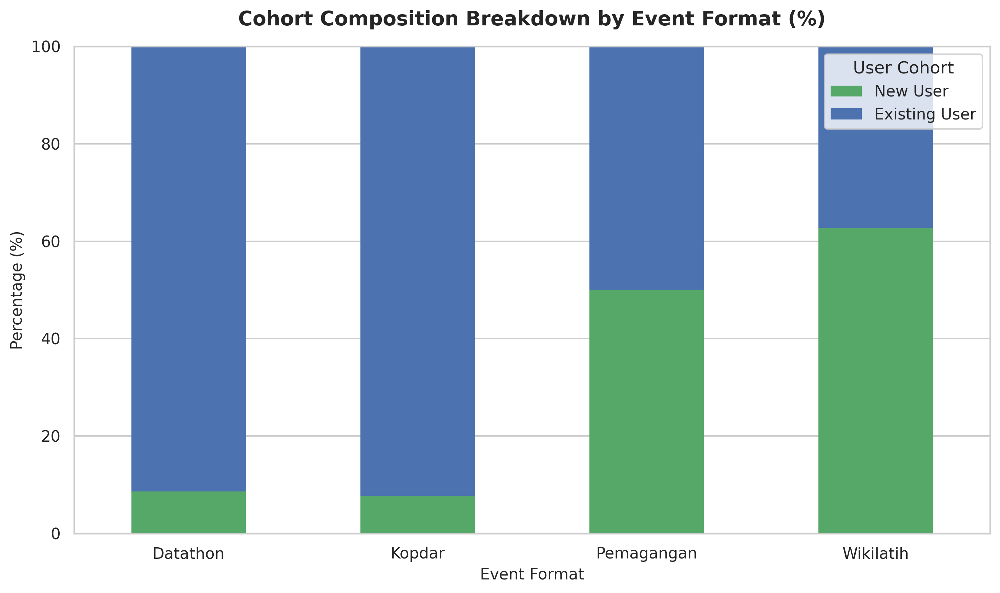
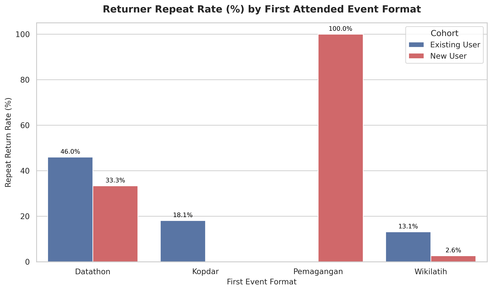
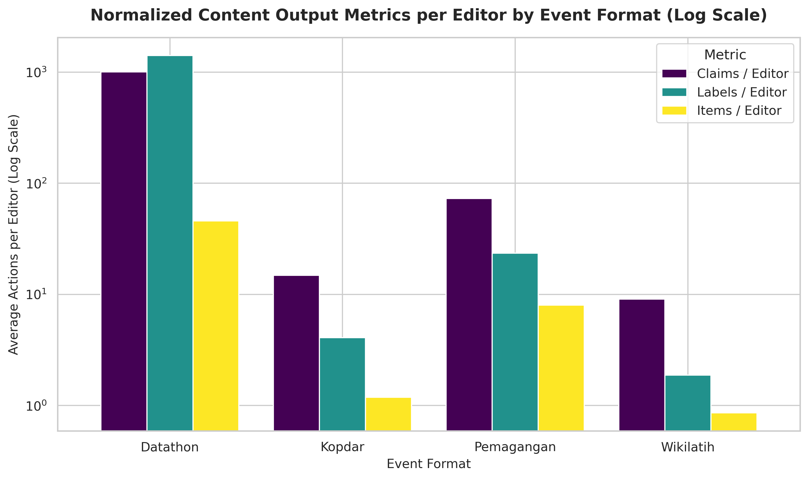

# Wikimedia Indonesia Data & Technology Program Analytics (2025–2026)

## Overview
This repository contains data analytics pipelines, data cleaning scripts, and post-event retention tracking models for the Data and Technology Team of Wikimedia Indonesia. The primary goal is to evaluate training outcomes, editor engagement, long-term retention, and content contributions across Wikidata activities.

The dataset covers campaign activities from 2025 through 2026, capturing cohort performance and content productivity across regional workshops, university training programs (**Wikilatih**), edit-a-thons (**Geodatathon / Datathon**), regional community gatherings (**Kopdar**), and structured internships (**Pemagangan**).

---

## Interactive Dashboard
Access the live Streamlit interactive dashboard here:
👉 **[Wikimedia Indonesia Retention & Content Analytics Dashboard](https://hisyam-wikimedia-id-retention-analysis.streamlit.app/)**

---

## Data Source & Attribution
All data in this repository is sourced publicly from the Wikimedia Outreach Dashboard:
* **Campaign Overview:** [Wikimedia Indonesia Data and Technology Campaign 2025](https://outreachdashboard.wmflabs.org/campaigns/data_dan_teknologi_wikimedia_indonesia_2025/overview)
* **Target Project:** [Wikidata](https://www.wikidata.org/wiki/Wikidata:Main_Page)

---

## Campaign Summary Statistics
Key metrics extracted from the Outreach Dashboard datasets:
* **Total Training Events:** 33 activities
* **Total Enrollments:** 446 enrollments (369 unique editors post-cleaning)
* **Total Revisions:** Over 370,000 edits
* **Total Wikidata Items Created:** Over 7,300 items
* **Total Statements/Claims Created:** Over 114,000 claims
* **Total Labels Added:** Over 143,000 labels

---

## Methodology & Retention Framework
1. **Data Cleaning & Deduplication:** Resolving string/numeric mismatches, standardizing datetime fields, and filtering duplicate backup event logs (e.g., `- Cadang` courses).
2. **Event Typology Derivation:** Categorizing events into **Wikilatih** (training), **Datathon** (competitions), **Kopdar** (gatherings), and **Pemagangan** (internships) via title and slug pattern matching.
3. **Cohort Locking:** Locking participant user cohort status (`New User` = 7 days or less account age vs. `Existing User` > 7 days) based on their relative account age at their chronological **first attended event**.
4. **Repeat Return Analysis:** Tracking multi-event participation rates to calculate post-onboarding return rates per entry format.
5. **Normalized Content Impact Analysis:** Evaluating editing productivity by calculating claims, labels, and items created normalized per editor across event formats.

---

## Key Findings & Insight Analysis

### 1. Cohort Composition & Retention Overview
Participation analysis across 369 unique editors reveals distinct operational profiles across event typologies:

| Event Type | Existing User Share (%) | New User Share (%) | First-Timer Repeat Rate (%) | Primary Operational Role |
| :--- | :--- | :--- | :--- | :--- |
| **Wikilatih** | 37.25% | **62.75%** | **2.60%** | Top-of-Funnel Acquisition / Onboarding |
| **Datathon** | **91.40%** | 8.60% | 33.33% | High-Volume Data Production Hub |
| **Kopdar** | **92.31%** | 7.69% | 0.00% | Community Cohesion & Networking |
| **Pemagangan** | 50.00% | 50.00% | 100.00% | Sustained Skill Mentorship |

* **Top-of-Funnel Bottleneck:** **Wikilatih** serves as the primary gateway for new contributor acquisition (62.75% New Users). However, first-time participants joining via Wikilatih experience a steep drop-off, yielding a post-onboarding repeat return rate of only **2.60%** (4 out of 154 new users returned).
* **Community-Driven Events:** **Datathons** (91.40% Existing Users) and **Kopdar** sessions (92.31% Existing Users) rely almost entirely on pre-established community members.

---

### 2. Content Contribution Profiles (Productivity per Editor)
A normalized evaluation of content outputs per editor illustrates the editing density across event formats:

| Event Type | Total Events | Total Editors | Claims / Editor | Items / Editor | Labels / Editor | Output Characteristic |
| :--- | :--- | :--- | :--- | :--- | :--- | :--- |
| **Datathon** | 4 | 93 | **1,002.22** | **45.83** | **1,410.74** | High-density mass data input |
| **Pemagangan** | 2 | 2 | 73.00 | 8.00 | 23.50 | Moderate structured output |
| **Kopdar** | 8 | 92 | 14.87 | 1.18 | 4.08 | Light editing & social engagement |
| **Wikilatih** | 15 | 233 | 9.08 | 0.86 | 1.88 | Introductory onboarding edits |

* **Productivity Hubs:** **Datathons** function as high-output content engines, averaging **>1,002 claims** and **>1,410 labels** per editor.
* **Learning Curve Reality:** Introductory workshops naturally yield lower edit volume per user as beginners navigate Wikidata's graph structure and ontology requirements.

---

## Strategic Recommendations
1. **Structured Post-Wikilatih Activation Pathways:** Implement automated follow-up communication within 14 days of a Wikilatih workshop to connect new editors with local Kopdar gatherings or beginner-friendly Datathon tracks before drop-off occurs.
2. **Targeted Audience Acquisition:** Focus specialized Wikilatih outreach toward academic institutions, GLAM partners, and domain-specific research groups whose existing technical background reduces onboarding friction.
3. **In-Session Feedback Loops:** Integrate live query visualizations (such as SPARQL query results or dynamic Wikidata dashboards) into introductory training sessions to provide first-time contributors with immediate visual impact for their edits.

---

## License & Attribution

### Code & Visualizations
All analysis scripts, Python code, and Streamlit dashboard files are licensed under the **[MIT License](https://opensource.org/licenses/MIT)**.

### Data & Documentation
All data summaries, documentation, and graphical charts are licensed under the **[Creative Commons Attribution-ShareAlike 4.0 International (CC BY-SA 4.0)](https://creativecommons.org/licenses/by-sa/4.0/)** license.